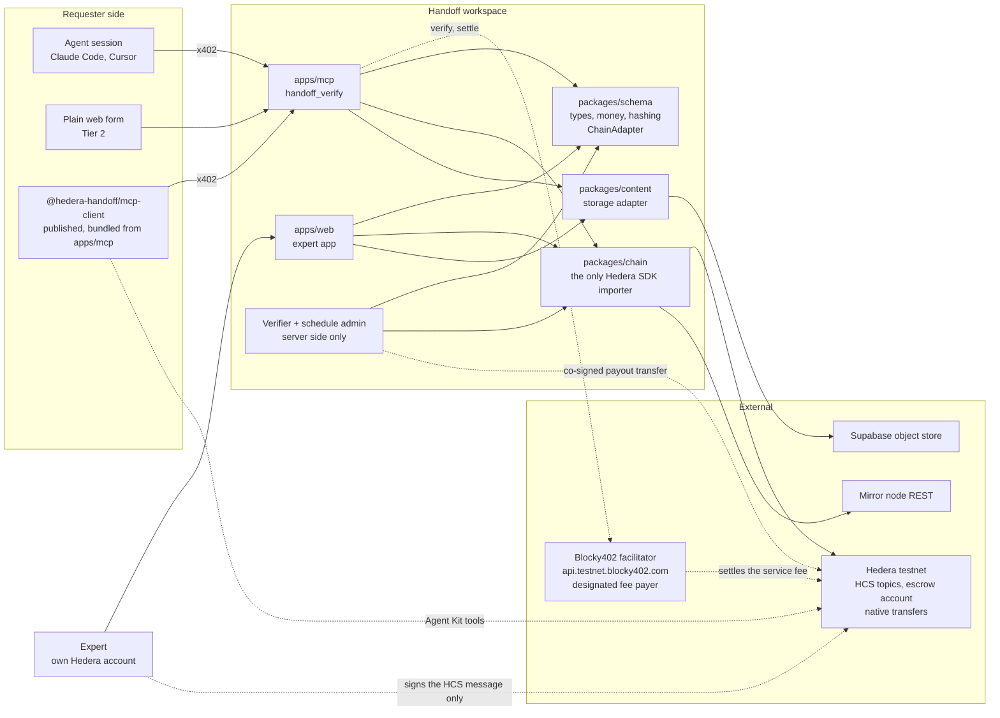
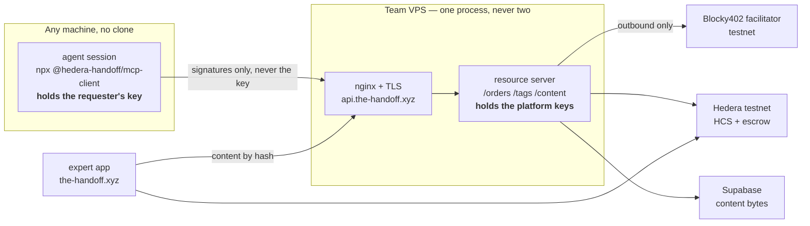
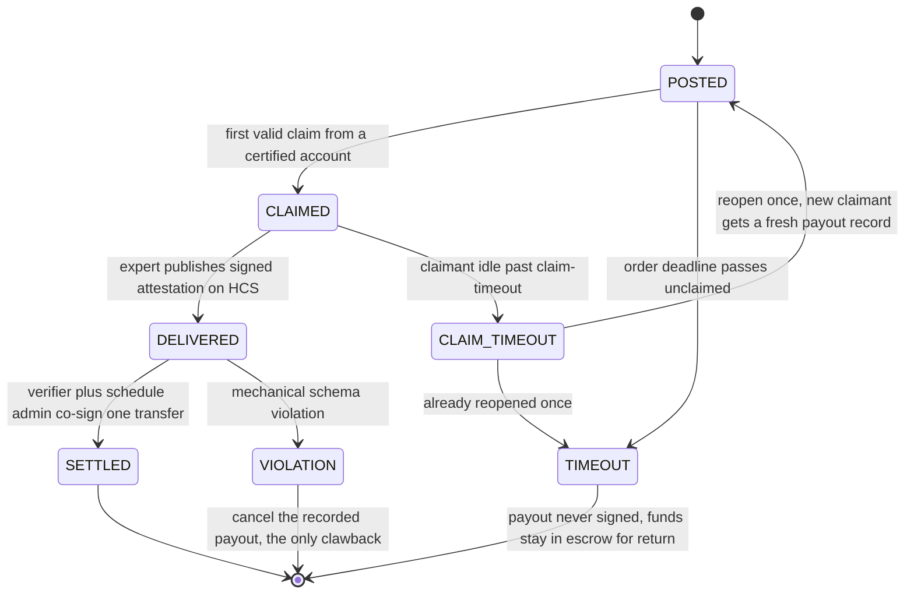
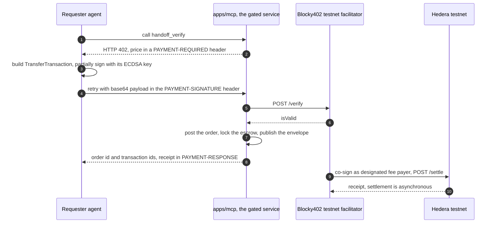
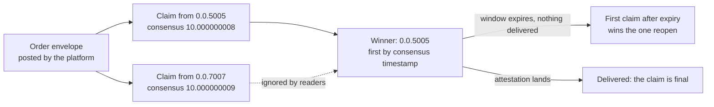
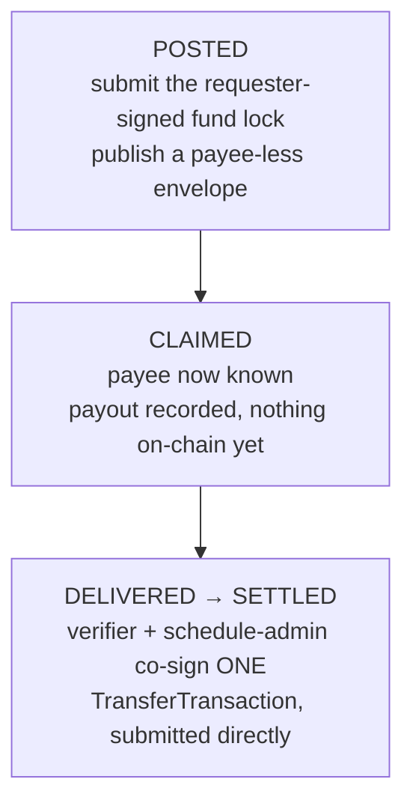
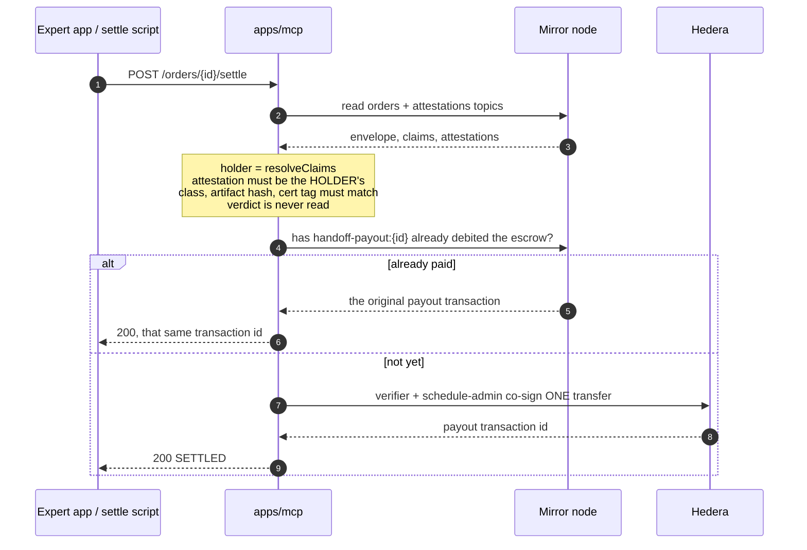

# Architecture

Mermaid in markdown so it is diffable and any session can regenerate it. **Keep this
current in the same pull request as the change it describes.** A diagram that disagrees
with the code is worse than no diagram.

Nothing here is settled beyond the brief. The schedule-timing question that used to sit
at the bottom is settled: the payout is committed at claim and Hedera's Schedule Service
is not used at all — see the section at the end for why, and what replaced it.

## Components



Two rules the picture encodes:

- Only `packages/chain` imports the Hedera SDK. Everything else goes through the
  `ChainAdapter` interface that `packages/schema` owns, which is what makes the
  mock-to-testnet cutover a one-line swap.
- The verifier and schedule-admin keys live in a server-side process only. Nothing with
  a browser build ever holds them.

## Where it runs



Two properties this shape is chosen for. **The requester's key never reaches the VPS** —
the client signs the service fee and the fund lock locally, and only signatures cross.
And **the facilitator is only ever called outward**, so nothing needs to reach in.

The single process is a constraint, not a preference: payout bookkeeping is an in-memory
map (`packages/chain/src/pending-payout.ts`), so a claim recorded in one instance and a
signature arriving at another is a payout that never fires. No serverless, no second
replica. Decided in
`decisions/2026-09-10-one-hosted-resource-server-and-a-published-client.md`.

## Order lifecycle



Three things this diagram is load-bearing for:

- **`CLAIM_TIMEOUT` and `TIMEOUT` are different events.** Claim-timeout is short relative
  to the order deadline, so a lazy claimant cannot hold funds hostage. Do not collapse
  them into one timer.
- **Consensus timestamp decides who won a claim.** The expert app may render a claim
  optimistically, but it has to handle losing the race when the mirror node confirms an
  earlier one.
- **`DELIVERED` to `SETTLED` is an idempotent retry.** If the verifier is asleep when the
  expert signs, the attestation still stands on HCS and payment lands on recovery. Never
  double-pay.

## Happy path

```mermaid
sequenceDiagram
    autonumber
    participant R as Requester agent
    participant M as apps/mcp
    participant S as Content store
    participant H as Hedera testnet
    participant E as Expert in apps/web
    participant V as Verifier and schedule admin

    R->>M: handoff_verify with class, cert tag, price, deadline
    M-->>R: 402: service fee due, plus an unsigned fund lock and the order id
    Note over R,M: the requester signs both on their own machine; no key reaches the server
    R->>M: retry with PAYMENT-SIGNATURE, order id and the signed fund lock
    M->>S: store artifact, take hash
    M->>H: submit the requester-signed lock, publish order envelope on HCS
    H-->>M: transaction ids
    M-->>R: order id, escrow tx, topic id
    E->>H: publish claim message on the orders topic, from the expert's own account
    Note over E,H: consensus timestamp decides the race; the payer account is the claimant
    E->>S: fetch artifact by signed URL
    E->>H: publish signed attestation from the expert's own account
    V->>H: read the attestation from a mirror node
    V->>V: validate against the order schema
    V->>H: co-signed transfer, idempotent
    H-->>E: payment executed
    E->>H: mirror-node read confirms settlement
```

Hashes only cross the chain boundary. The artifact and the expert's written notes go to
the content store; only `artifact_hash_in` and `notes_hash` reach HCS.

## The x402 service gate

Distinct from the escrow, and the two must never be conflated. The service fee is a
micropayment for calling `handoff_verify`. The order value is the price of the judgment
and it goes to escrow.



The facilitator is the designated fee payer, so the client never pays gas and the client's
key never leaves the client. Facilitator base URL is `https://api.testnet.blocky402.com`
and the network identifier is `hedera:testnet`. The mainnet host is forbidden by hard
rule 5.

Three constraints the diagram does not show. The x402 signer must be an **ECDSA**
account. Payment is in **HBAR**, not USDC, because USDC on testnet needs a token
association on both accounts first. The x402 receiver is a **separate account** from the
escrow, never the escrow threshold key.

## Escrow quorum

Two of three on the escrow account.

| Key | Held by | Signs for |
|---|---|---|
| Requester session key | The requester | Clawback, with the platform |
| Platform verifier key | Us | Early execute, and clawback |
| Schedule admin key | Us | Early execute, and cancelling a recorded payout |

Early execute is verifier plus admin, after the attestation validates. Clawback is
requester plus platform, only after a mechanical schema failure.

**Admitted honestly:** the verifier key and the admin key are both ours this week, so a
compromised backend has quorum. Two Node processes on one team are not two custodians.
Decentralizing the verifier is the production roadmap.

The escrow is one shared account this week, provisioned once; every order locks into it
and per-order accounting is off-chain. One account per order is roadmap, decided in
`docs/decisions/2026-09-07-one-shared-escrow-account-this-week.md`.

## The claim message

Claiming is an HCS message on the orders topic, submitted from the expert's own account.
The body is four fields, `{ kind: "claim", order_id, cert_tag, schema_version }`, because
the topic message already carries who and when: the payer account is the claimant and
the consensus timestamp is the claim time. The order envelope has no `kind` field and
both shapes are strict, so a parser cannot confuse them.



The rule is `resolveClaims` in `packages/schema`, called by both ends so the expert app
and the requester's status tool never disagree about who holds an order. A claim counts
only if its order id and credential tag match and it landed before the deadline. The
sign-by time is the claim time plus the claim timeout, capped at the deadline. The
winning claim is what records the payout, since it is the first moment the payee is
known.

## Settled: the payout is committed at claim, and Hedera's Schedule Service is not used

This was "variant A or variant B" until Sep 8. The answer turned out to be neither,
because **`ScheduleCreateTransaction` cannot debit a `KeyList` account at all** —
`INVALID_SIGNATURE`, reproduced across eight isolated testnet runs, root cause still
unresolved with Hedera (NAS-5). See
`research/schedule-create-keylist-blocker.md`, and
`decisions/2026-09-08-direct-cosigned-payout-replaces-schedulecreate.md` for the
replacement.



Why this is not a downgrade: Hedera's Schedule Service exists so signers who act at
**different times, from different processes** can accumulate signatures on a
transaction. We do not have that problem — the verifier and schedule-admin keys are
both held by the same trusted backend, which root `CLAUDE.md` already admits out loud.
Both signatures are available in the same call, so the payout is one directly
co-signed transfer instead.

Two consequences that keep the old shape's guarantees:

- **Idempotency** was `IDENTICAL_SCHEDULE_ALREADY_CREATED`, given free by the network.
  It is now two levels, and it needs both. In-process, `derivePendingPayoutId` is a
  deterministic hash of the payout's parameters, so identical params resolve to the
  identical id and signing an already-executed payout returns success without
  re-submitting. Across a restart, where that map is empty, the **mirror node** is the
  memory: every payout carries the memo `handoff-payout:<order_id>`, and `signSchedule`
  asks whether that memo already appears among the escrow's debits before it composes a
  signature. Without the second level, "never double-pay" holds only until the first
  crash. See
  `decisions/2026-09-12-settle-is-an-explicit-endpoint-and-idempotency-lives-on-the-mirror.md`.
- **The post-to-claim window** is still protected by the threshold key alone, still
  trusted-platform, still admitted out loud.

The demo narration says **"committed at claim"**, never "committed at post". What
happens at DELIVERED is a co-signed transfer, not a `ScheduleSign` — say "the platform
co-signs and the money moves", not "the schedule fires".

### Who asks for the payout

`POST /orders/{id}/settle` on the resource server, an explicit call rather than a
watcher. A background re-scan of the attestations topic would, after any restart, meet
already-paid orders with an empty payout map; the mirror read makes a *retry* safe, which
is a reason to let a caller retry rather than to poll on their behalf.



The refusals are as load-bearing as the payment. A caller gets `409` with `retryable:
true` while the order is not yet delivered — the mirror node lags about six seconds
behind consensus, so an expert settling the instant they publish will see it — and
`409` with `retryable: false` on a mechanical schema violation, which never becomes
payable. A chain failure is `502` with the detail intact, because that message may carry
the transaction id of a payout whose outcome is unknown.

An attestation from an account that never held the claim is **noise, not a violation**:
it does not pay, and it does not shadow the holder's real one either. The attestations
topic has no submit key, so otherwise anyone could freeze any expert's payment for the
price of one HCS message.

Verified end to end on real testnet against the provisioned escrow
(`packages/chain/scripts/live-happy-path.ts`): real fund lock, real co-signed payout,
`SUCCESS` read back from a mirror node, and a second `signSchedule` that does not pay
twice.
